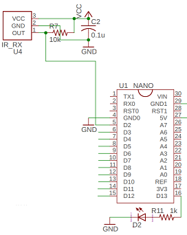

## アナログリモコン プロトコル
* [1.特徴](#1特徴)
* [2.コード](#2コード)
* [3.エンコード、タイミング](#3エンコードタイミング)
* [4.使用例](#4使用例)
* [5.UART通信プロトコル](#5uart通信プロトコル)

### 1.特徴
アナログリモコンはNECフォーマットなど通常の赤外線方式比較して下記特徴があります。衝突を前提としたフォーマットになっており、CH1, CH2, CH3それぞれで送信周期を変えることで3つまでの赤外線リモコンを同時に使うことが出来ます。
||NECフォーマット|アナログリモコン|効果|
|---|:-:|:-:|---|
|送信周期|108ms|CH1-50ms CH2-66ms CH3-40ms|複数CH対応、レスポンス向上、衝突した時の挙動改善|
|送信bit数|32bit|15bit||
|送信時間|~85.4ms(~152T)|11.6ms(33T)|レスポンス向上、複数のリモコンが送信したとき衝突しにくいように|
|リピートコード|使用|未使用|最初の送信が衝突しても問題ないように|
|ボタンを離したとき|送信停止|2秒間送信|ボタンを離したときの挙動改善|

### 2.コード
アナログリモコンは15bitの独自フォーマットになっています。
|ビット|機能|データ|
|---|---|---|
|bit14~13|リモコンチャンネル|01-Channel1 10-Channel2 00-Channel3|
|bit12~8|ジョイスティック上下|11111-上 10000-中立 00000-下|
|bit7~3|ジョイスティック左右|11111-右 10000-中立 00000-左|
|bit2~0|キー|000-OFF 001-CENTER 010-UP 011-RIGHT 100-LEFT 101-DOWN|

### 3.エンコード、タイミング
キャリア周波数 38kHz  
T=350us  
リモコンコードはスタートビットから始まる [biphaseエンコード](https://ja.wikipedia.org/wiki/%E4%BC%9D%E9%80%81%E8%B7%AF%E7%AC%A6%E5%8F%B7) になってます。01 10000 10000 000のとき

|データ|赤外線出力|
|---|---|
|スタートビット|000(3T)|
|bit[n]=1|10又は01(1Tx2)|
|bit[n]=0|11又は00(2T)|

### 4.使用例
リモコンロボ、クアッドクローラー以外にもarduinoライブラリを使うことで、他のロボットでも使うことが出来ます。
[mBot＋アナログリモコン(動画)](http://sohta02.web.fc2.com/images/MAQ04884.MP4)  

ぜひアナログリモコンであなたのロボットを操縦してみて下さい。Arduinoライブラリは「つくるっち」アプリの ext/arduinoLib にあります。  
[「つくるっち」ダウンロード＆説明](http://sohta02.web.fc2.com/familyday_app.html)

アナログリモコンを使う場合下記の制約があります。
- Atmega328pのみ対応
- 赤外線リモコン入力＝D2 (INT0)
- Timer0使用 (250kHz,8bit = 977Hz)

[リモコンロボ回路図](http://sohta02.web.fc2.com/release/2018FD.190603.pdf)  
  

### 5.UART通信プロトコル
リモコン通信は特殊なプロトコルを使っています。
||戻り値|
|---|---|
|byte4|キーコード|
|byte5~6|ジョイスティックX|
|byte7~8|ジョイスティックY|

キーコードはアナログリモコン、標準リモコン（NECフォーマット）両対応です。
|ボタン|キーコード|
|---|---|
|POWER|0x45|
|B|0x46|
|MENU|0x47|
|TEST|0x44|
|RETURN|0x43|
|C|0x0D|
|UP|0x40|
|LEFT|0x07|
|CENTER|0x15|
|RIGHT|0x09|
|DOWN|0x19|
|0|0x16|
|1|0x0C|
|2|0x18|
|3|0x5E|
|4|0x08|
|5|0x1C|
|6|0x5A|
|7|0x42|
|8|0x52|
|9|0x4A|
|アナログCENTER|0x61|
|アナログUP|0x62|
|アナログRIGHT|0x63|
|アナログLEFT|0x64|
|アナログDOWN|0x65|

クアッドクローラー用ライブラリはジョイスティック操作もキーコードとして返します。
|ボタン|キーコード|
|---|---|
|ジョイスティックUP_R|0x70|
|ジョイスティックUP|0x71|
|ジョイスティックUP_L|0x72|
|ジョイスティックRIGHT|0x73|
|ジョイスティックLEFT|0x74|
|ジョイスティックDOWN_R|0x75|
|ジョイスティックDOWN|0x76|
|ジョイスティックDOWN_L|0x77|
