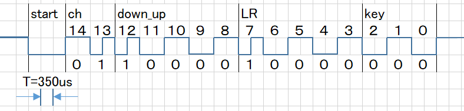

## アナログリモコン プロトコル
* [1.コード](#1コード)
* [2.エンコード、タイミング](#2エンコードタイミング)
* [3.送信周期](#3送信周期)
* [4.使用例](#4使用例)
* [5.UART通信プロトコル](#5uart通信プロトコル)
### 1.コード
アナログリモコンは15bitの独自フォーマットになっています。
| ビット | 機能 | データ |
| ---- | ---- | ---- |
| bit14~13 | リモコンチャンネル | 01-Channel1  10-Channel2  00-Channel3 |
| bit12~8 | ジョイスティック上下 | 11111-上  10000-中立  00000-下 | 
| bit7~3 | ジョイスティック左右 | 11111-右  10000-中立  00000-左 | 
| bit2~0 | キー | 000-OFF  001-CENTER  010-UP  011-RIGHT  100-LEFT  101-DOWN | 

NECフォーマットなど通常の赤外線方式比較して下記特徴があります。
| | NECフォーマット | アナログリモコン |
| ---- | ---- | ---- |
| 送信周期 | 108ms | 40~66ms |
| 送信bit数 | 32bit | 15bit |
| 送信時間 | 85.4ms(152T) | 11.6ms(33T) |
| ボタンを離したとき | 送信停止 | 2秒間送信 |

### 2.エンコード、タイミング
キャリア周波数 38kHz  
T=350us  
リモコンコードはスタートビットから始まるbi-phaseエンコードになってます。01 10000 10000 000のとき
  

スタート 000(3T)  
bit=1のとき10又は01 (1T)  
bit=0のとき11又は00 (2T)  

### 3.送信周期
CH1, CH2, CH3それぞれで送信周期を変えることで、3つまでの赤外線リモコンを同時に使うことが出来ます。
| チャンネル | 送信周期 |
| ---- | ---- |
| CH1 | 50ms周期 |
| CH2 | 66ms周期 |
| CH3 | 40ms周期 |

### 4.使用例
リモコンロボ、クアッドクローラー以外にもarduinoライブラリを使うことで、他のロボットでも使うことが出来ます。
[mBot＋アナログリモコン(動画)](http://sohta02.web.fc2.com/images/MAQ04884.MP4)  
ぜひアナログリモコンであなたのロボットを操縦してみて下さい。アナログリモコンを使う場合下記の制約があります。
- 赤外線リモコン入力＝D2 (INT0)
- Timer0使用 (250kHz,8bit = 977Hz)

### 5.UART通信プロトコル
リモコン通信は特殊なプロトコルを使っています。
| | 戻り値 |
| ---- | ---- |
| byte4 | キーコード |
| byte5~6 | ジョイスティックX |
| byte7~8 | ジョイスティックY |

| ボタン | キーコード |
| ---- | ---- |
| POWER | 0x45 |
| B | 0x46 |
| MENU | 0x47 |
| TEST | 0x44 |
| RETURN | 0x43 |
| C | 0x0D |
| UP | 0x40 |
| LEFT | 0x07 |
| CENTER | 0x15 |
| RIGHT | 0x09 |
| DOWN | 0x19 |
| 0 | 0x16 |
| 1 | 0x0C |
| 2 | 0x18 |
| 3 | 0x5E |
| 4 | 0x08 |
| 5 | 0x1C |
| 6 | 0x5A |
| 7 | 0x42 |
| 8 | 0x52 |
| 9 | 0x4A |
| アナログCENTER | 0x61 |
| アナログUP | 0x62 |
| アナログRIGHT | 0x63 |
| アナログLEFT | 0x64 |
| アナログDOWN | 0x65 |

クアッドクローラーはジョイスティック操作もキーコードとして返します。
| ボタン | キーコード |
| ---- | ---- |
| ジョイスティックUP_R | 0x70 |
| ジョイスティックUP | 0x71 |
| ジョイスティックUP_L | 0x72 |
| ジョイスティックRIGHT | 0x73 |
| ジョイスティックLEFT | 0x74 |
| ジョイスティックDOWN_R | 0x75 |
| ジョイスティックDOWN | 0x76 |
| ジョイスティックDOWN_L | 0x77 |
