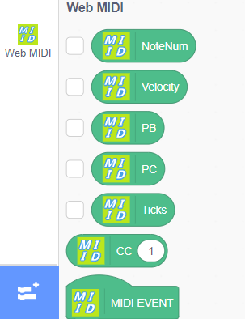
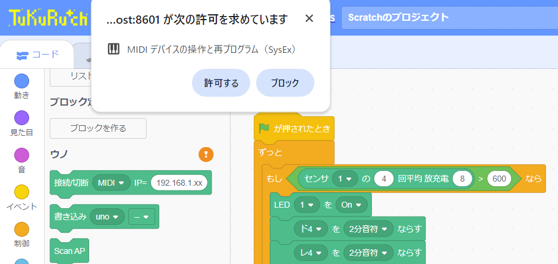

## つくるっち - ダンスロボット＆MIDI対応経緯

#### 1. メイの夏休みの宿題で作ったハトロボ - ダンス版（2018）  
MP3の音楽に合わせ、赤外線リモコンのコードを送信しています。ArduinoのC言語で実装、つくるっち対応しませんでした。  
<video src="https://sohtamei.github.io/docs/images/robotTeam.mp4" controls height="400"></video>

#### 2. クレア＋QuadCrawlerでのダンス（つくるっち-loadVMD拡張）（2022）  
市販のロボットクレアを砂川氏が魔改造し2022 MakerFaireTokyo出展。  
それを元にハードウェアはそのまま、ソフトをそーたメイがつくるっち環境でダンスに対応させたもの。  
MikuMikuDanceでモーションを生成し、つくるっちでモーションを再生しています。音楽はMP3で、1と同じ「よーいドン」方式です。  
<video src="https://sohtamei.github.io/docs/images/MAH06392b.mp4" controls height="600"></video>

#### 3. つくるっち - UchiwaFuujinn氏のWebMidi拡張対応  
UchiwaFuujinn氏のwebMidi拡張を取り込み。MIDIデバイスが必要で、残念ながらちゃんと使いこなせませんでした。  
ただ4.の参考になりました。  

#### 4. つくるっち - USBでのandroid/iOS接続対応  
つくるっちFWを焼いたマイコンとつくるっちアプリをUSB-MIDIプロトコルで接続します、android/iOS用。MIDIデバイスや音楽機能との直接の関係はありません、ややこしいです。  
android/iOSはUSB-UARTプロトコルでUSBケーブル接続することは出来ませんが、（何故か）USB-MIDIプロトコルだと可能です。（iOSはscrubアプリを使用）これを利用してandroid/iOSでのUSBケーブル接続に対応しました。現在PICO(RP2040)のみ対応、ESP32シリーズは非対応です。  
  

(参考) [iPad接続手順、android接続手順](http://sohta02.web.fc2.com/familyday_orgel.html#ipad)  

#### 5. つくるっち - MIDIファイル読み込み＆再生対応（光センサオルゴール）  
つくるっちはパソコンやスマフォからのプログラム実行に対応（オンライン動作）、マイコン単体での実行（スタンドアロン動作）に非対応です。プログラミング学習としては問題ないのですが、工作としては不便です。  
そのため2023/春のワークショップ「光センサオルゴール」では作成した音楽とLEDの点滅の記録・再生に対応しました。スタンドアロン動作は任意の音楽・LED点滅の「光センサオルゴール」固定です、他の機能に変えることは出来ません。  
[2023御殿山さくらまつり](http://sohta02.web.fc2.com/familyday_event.html#gotenyama2023_1)
<iframe width="560" height="315" src="https://www.youtube.com/embed/SY_fQ4cUTFA" title="YouTube video player" frameborder="0" allow="accelerometer; autoplay; clipboard-write; encrypted-media; gyroscope; picture-in-picture; web-share" allowfullscreen></iframe>

ワークショップの際「楽譜で入力したい」「和音再生したい」というリクエストを多く頂戴したため、つくるっちでのMIDIファイル読み込み・記録・再生に対応しました。  
[loadMIDサンプル](https://sohta02.sakura.ne.jp/tukurutch/index.html#000002007)

loadMIDでMIDIファイルをロードするとdataMIDにMIDIデータを読み込みます。set melodyブロックで光センサオルゴールに書き込むことでMIDIデータを再生することができます。二重和音はブザーを二個にすることで対応しました。同時に２つまでの音しか鳴らせないため、track1の一番高い音とtrack2の一番低い音を再生します。現在ESP32とPICO(RP2040)対応。  
<video src="https://sohtamei.github.io/docs/images/MAH07079s.mp4" controls height="400"></video>
