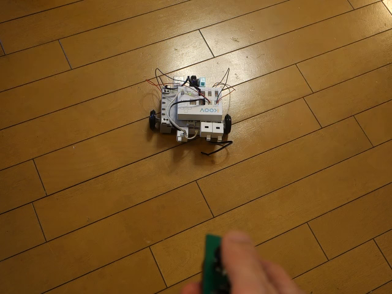

## Koovプログラミング情報

つくるっち＋Koovでのプログラミングに対応しました。リモコンロボ同様 BitTradeOne社の「汎用赤外線リモコン」、「アナログリモコン」でロボットを操縦することができます。  
**公式アプリではなく、まだ多数不具合があります。注意して下さい。**  
Windowsのみ対応(MAC, iPad非対応)、USB接続のみ対応(BLE,Wifi接続非対応)です。  
 クリックで再生  

### サンプルプログラム
つくるっちで [ロボット] - [Koov] を選択し、[プログラム] - [開く] で選択して下さい。
- アナログリモコン.sb2
- デジタルリモコン1.sb2
- デジタルリモコン2.sb2
- ドレミ.sb2

### 必要なもの
- Artec社の「[ロボット用赤外線リモコン受信センサー](https://www.amazon.co.jp/dp/B00VFZ0NX8)」
- BitTradeOne社の「[KRIR汎用赤外線リモコン](https://btoshop.jp/2018/10/12/4562469772134/)」又は「[赤外線ジョイスティックリモコン](https://btoshop.jp/2020/03/16/adkrjs/)」

### 接続方法
- V0とV1にモーターを接続
- V2にブザーを接続
- K7に「ロボット用赤外線リモコン受信センサー」を接続

### 使い方（PC通信モード）
- ロボットの電源を入れUSBで接続し、
- [接続] - [ロボットに接続(COM ..)]
- [接続] - [ロボットをPC通信モードに設定]
- ブロック [プログラム開始] をクリック

### 使い方（Arduinoモード）
- ロボットの電源を入れUSBで接続し、
- [接続] - [ロボットに接続(COM ..)]
- [Arduino] - [Arduinoにアップロード]
