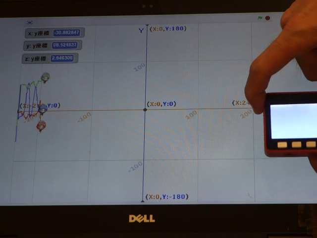
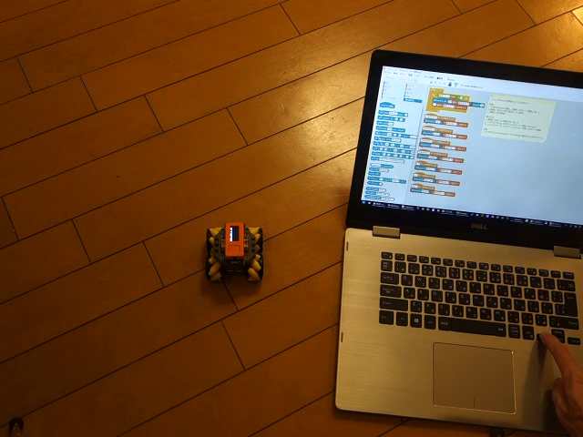
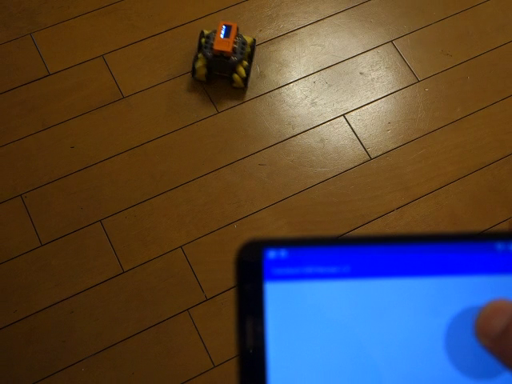
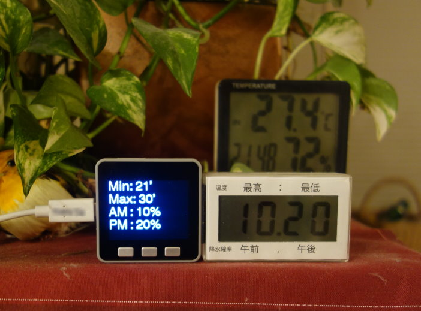

## M5Stack, M5StickCプログラミング情報
つくるっちでM5Stack, M5StickCのプログラミングに対応しました。USB又はWiFi経由でプログラミングを行うことが出来ます。  
４種類のサンプルプログラムを用意しました。
- [センサの三次元グラフ表示](#ses1)
- [Wifiキーボード操縦](#ses2)
- [Wifiリモコン操縦](#ses3)
- [全国142箇所の天気予報（気温・降水確率）をリアルタイム表示](#ses4)

## センサの三次元グラフ表示
加速度グラフ / 加速度グラフxyz / ジャイログラフxyz  
M5Stack/M5SickC内蔵のセンサ（加速度、ジャイロ、温度）をパソコン上でグラフ表示するプログラムです。  

クリックで再生  

初期設定  
1. USB接続で [接続] - [ロボットをPC通信モードに設定]、[WiFi設定]  
2. ブロック [get IMU Pitch] で測定したいデータを選択  

使い方  
1. [ステージ表示] をクリック  
2. USB又はWiFi接続して緑の🏴（加速度グラフ.sb2はブロック[大きさを20%にする]）をクリック  
3. M5Stack/M5STickCを横に振って、グラフが変化するか確認  

注意  
・グラフからはみ出すときは * 10 を変えてみて下さい。  
・(加速度グラフ.sb2)「測定したいデータ」を変更したときは一度ブロックをクリックしてグラフを止め、もう一度ブロックをクリックしてグラフ表示を再開して下さい。  

## Wifiキーボード操縦
android用アプリ TuKuRutch Wifi Remote でRoverCを操縦するプログラムです。  

クリックで再生  

準備 (つくるっち)  
1. USBでロボットと接続し、[接続] - [ロボットに接続(COM ..)]  
2. [接続] - [ロボットをPC通信モードに設定]  
3. [接続] - [WiFi設定]  

準備 (android)  
4. TuKuRutchWifiRemote.apkをインストールして実行（そーたメイサイト参照）  

操作方法  
1. [接続] - [ロボットに接続(192.168...)]  
2. このプログラムの「プログラム開始」をクリック （黄色く光らせる）  
3. android用アプリのジョイスティックを操作してロボットを操縦  

注意  
- iphoneは非対応です。  
- Arduinoモードに対応してます。[Arduinoにアップロード] でプログラムをロボットに書き込むことが出来ます。  
 
## Wifiリモコン操縦
パソコンでRoverCを操縦することが出来ます。  

クリックで再生  

準備  
1. USBでRoverCと接続し、[接続] - [ロボットに接続(COM ..)]  
2. [接続] - [ロボットをPC通信モードに設定]  
3. [接続] - [WiFi設定]  

操作方法  
1. [接続] - [ロボットに接続(192.168...)]  
2. このプログラム左上の「ずっと」をクリック （黄色く光らせる）  
3. パソコンのキーボードのカーソルとx, yキーを押してロボットを操縦  

注意  
・このプログラムは「Arduinoモード」（Arduinoに書き込む）は非対応です。  

## 全国142箇所の天気予報（気温・降水確率）をリアルタイム表示
日本の全国天気を表示するプログラムです。気象庁のデータを元に全国142箇所の天気（気温・降水確率）を5:00、11:00、17:00に更新します。  
（11:00以降は降水確率午前が "--" になります。17:00以降は翌日の予報になります）。  

初期設定  
1. USB接続で [接続] - [ロボットをPC通信モードに設定]、[WiFi設定]  
2. プログラムのブロック [天気(関東甲信越) 東京都東京] をお客様の地域に変更  

使い方  
・USBまたはWiFiで接続し、プログラムをクリック (PC通信モード)  

注意  
- Arduinoモードに対応してます。[Arduinoにアップロード] でプログラムをM5Stack/M5StickCに書き込むことが出来ます。  
