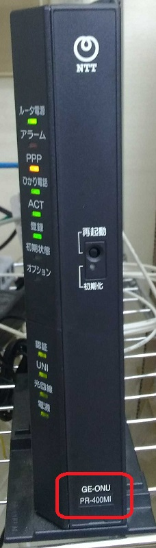
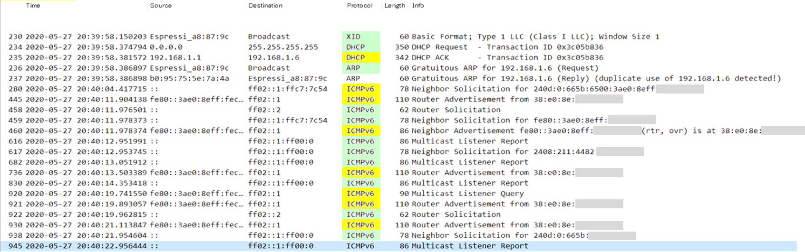

## NTT光ルーター PR-400MI/RT-400MI/RV-440MI 不具合について
ESP32 (Duke32AIO, M5Stack, M5StickCで使用) はIPv6に対応しており、つくるっちでは機能を無効にしてます。IPv6機能が無効化の状態でもWiFi接続時コマンドICMPv6を送信します。  
一方NTT光ルーター PR-400MI/RT-400MI/RV-440MI はESP32のICMPv6を受信すると高い確率で再起動してしまうソフト上の不具合があります。再起動が発生すると、3分程度全てのネットワークとひかり電話が使えなくなってしまいます。

### 対策方法
PR-400MI/RT-400MI/RV-440MI の設定変更・ソフト更新やESP32側のFW変更ではこの問題を解決することが出来ません。そのため該当の光ルーターを使っている場合は無線アクセスポイントをブリッジモードでなくルーターモードに設定して下さい。つくるっちを動かすPCも光ルーターでなく無線アクセスポイントに有線または無線で接続して下さい。

### ルーター確認方法
ご利用の光ルーターの機種を確認するには写真の赤枠部分を確認して下さい。  
  
この不具合はPR-400MIの最新ファームウェアで確認しました。

### 不具合詳細
ESP32ネットワーク接続からPR-400MI再起動までのネットワークのログです、ESP32が緑、PR-400MIが黄色です。
  
ESP32側のパケットに異常は見られませんでした。  
(2020/5/30)
