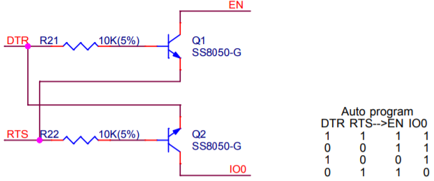

## つくるっちでのDTR/RTS制御について
つくるっちではロボットとの接続/切断時（物理的な接続切断でなくアプリ上での接続切断）にロボットをRESETしてます。つくるっちが対応しているATmega328p / ESP32 / SAMD(Koov)はそれぞれUARTのDTR/RTS信号をRESET, BOOT モード切り替えに使っており、各プラットフォームごとに方法が異なります。

| |ATmega328p|ESP32|Koov/SAMD|
|---|---|---|---|
|I/F|3線式 (RxD,TxD,DTR)|4線式 (RxD,TxD,DTR,RTS)|2線式? (RxD,TxD) マイコン内蔵|
|RESET端子(EN端子)|DTRがC経由で接続, DTR=H->Lの瞬間L|(DTR=H,RTS=L)でL, Cで遅延| |
|MODE端子(IO0)| |(DTR=L,RTS=H)でL| |
|BOOTモード|RESET直後に 特定のコマンドを送信|MODE端子=LでRESET (DTR=H->L, RTS=L->H)|1200bpsでUART接続|
|Bootloader書き込み|できない|できる|？|

接続/切断時のRESETについて

| |ATmega328p|WemosD1R32|QCAI|Koov/SAMD|
|---|---|---|---|---|
|Teraterm 接続中DTR=L,RTS=L|Y(接続時)|Y(切断時) `※PC依存ありそう` DTR↑から400us後にRTS↑|同左？|なし|
|Tukurutch3.0 接続中DTR=L,RTS=L|Y(接続時)|N RTSとDTRが同時↑|Y(切断時)| - |
|Tukurutch2.0 接続中DTR=L,RTS=H|Y(接続時)|Y(切断時ソフトRESET) `※接続中のRESETボタンで` `BOOTモードになる`|同左|Y(切断時ソフトRESET)|

DevkitCの回路図より  
  
