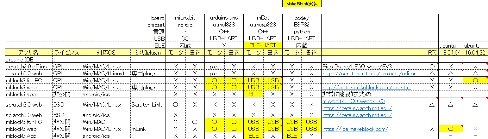

## スクラッチとmBlock、つくるっちについて
[つくるっちについて](http://sohta02.web.fc2.com/familyday_about.html)

### mBlockとつくるっち
つくるっちはMakeblock社のmBlock3を元に開発しました。その際スクラッチ2.0とmBlock3、スクラッチ3.0とmBlock5について調査を実施しました。下記の表は2018年ごろに調べた情報です。  

スクラッチはLEGO wedoやEV3など一部のHWにのみ対応し、arduinoには対応していません。Makeblock社はスクラッチ2.0とスクラッチ3.0を元にArduinoに対応したmBlock3とmBlock5を開発しました。mBlockは直感的で簡便なモニタモード(PC通信モード)と、本格的なプログラミングが可能な書き込みモード(Arduinoモード)に対応したすばらしいプログラミングアプリです。  

つくるっちはmBlock3のソースコードを元に開発しました。最新のmBlock5を元に開発したかったのですが、mBlock5はソースコードを公開していないため、つくるっちはGPLライセンスでソースコード公開されているmBlock3を元に開発しました。つくるっちでは簡単に拡張ブロックを作成できるようなっています。

＃mBlock3に対するmBlock5の特徴として「拡張ブロックが作りやすい」が挙げられているようです。
https://www.mblock.cc/doc/en/mblock3/mblock3-vs-mblock5.html

### スマフォ対応について
スマフォの普及によりご自宅にパソコンが無いご家庭が増えています。  
つくるっちでもスマフォ対応を検討したのですが、
- arduino IDEがスマフォに対応していない
- arduinoハードウェアの書き込みにUSB-UARTが必要であり、USB-UARTに対応したスマフォが少ない
- mBlock3など元となるアプリがない

という事情により、windowsパソコンのみの対応となっています。

### mBlock5の拡張デバイスについて
mBlock3、mBlock5には「デバイス」と「extension」があります。 
mBlock3では自作デバイスは非対応だったのですがmBlock5で自作デバイスに対応しました、たくさんのサードパーティ製デバイスがリリースされています。リモコンロボやクアッドクローラーのようなロボットをスクラッチ対応させる方法として下記２つの方法があります。
- mBlock3などのソースコードを元にスクラッチ互換アプリを作成（つくるっち）
- mBlock5の拡張デバイスを作成 https://ext.mblock.cc/?mblock-3#/login?r=/ 
実際にリモコンロボ用の「mBlock5拡張デバイス」作成に挑戦してみたのですが、node.jsのライブラリを１から実装する必要があり時間の都合からまだ完了していません。（拡張デバイス作成用のポータルサイトは素晴らしい！のですが。。） まだ完了してないため正確ではないのですが、つくるっち/mBlock5それぞれで拡張デバイスを作成

| |つくるっち|mBlock5|
|:--|:--:|:--:|
|対応OS|Win|Win/MAC|
|編集ファイル|json, (Cライブラリ)|ポータルサイトで設定,node.jsライブラリ,(Cライブラリ)|
|対応マイコン&言語|AVR-C,SAMD-C,ESP32-C|AVR-C,ESP32-python|
