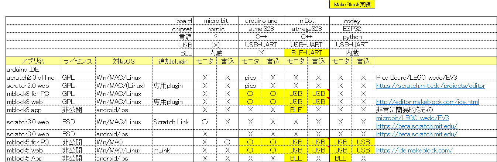

## スクラッチとmBlock、つくるっちについて
[つくるっちについて](http://sohta02.web.fc2.com/familyday_about.html)

### mBlockとつくるっち
つくるっちはMakeblock社のmBlock3を元に開発しました。その際スクラッチ2.0とmBlock3、スクラッチ3.0とmBlock5について調査を実施しました。下記の表は2018年ごろに調べた情報です。  

スクラッチはLEGO wedoやEV3など一部のHWにのみ対応し、arduinoには対応していません。Makeblock社はスクラッチ2.0とスクラッチ3.0を元にArduinoに対応したmBlock3とmBlock5を開発しました。mBlockは直感的で簡便なモニタモード(PC通信モード)と、本格的なプログラミングが可能な書き込みモード(Arduinoモード)に対応したすばらしいプログラミングアプリです。  

つくるっちはmBlock3のソースコードを元に開発しました。最新のmBlock5を元に開発したかったのですが、mBlock5はソースコードを公開していないため、つくるっちはGPLライセンスでソースコード公開されているmBlock3を元に開発しました。つくるっちでは簡単に拡張ブロックを作成できるようなっています。

＃mBlock3に対するmBlock5の特徴として「拡張ブロックが作りやすい」が挙げられているようです。
https://www.mblock.cc/doc/en/mblock3/mblock3-vs-mblock5.html

### スマフォ対応について
スマフォの普及によりご自宅にパソコンが無いご家庭が増えています。  
つくるっちでもスマフォ対応を検討したのですが、
- arduino IDEがスマフォに対応していない
- arduinoハードウェアの書き込みにUSB-UARTが必要であり、USB-UARTに対応したスマフォが少ない
- mBlock3など元となるアプリがない

という事情により、windowsパソコンのみの対応となっています。
