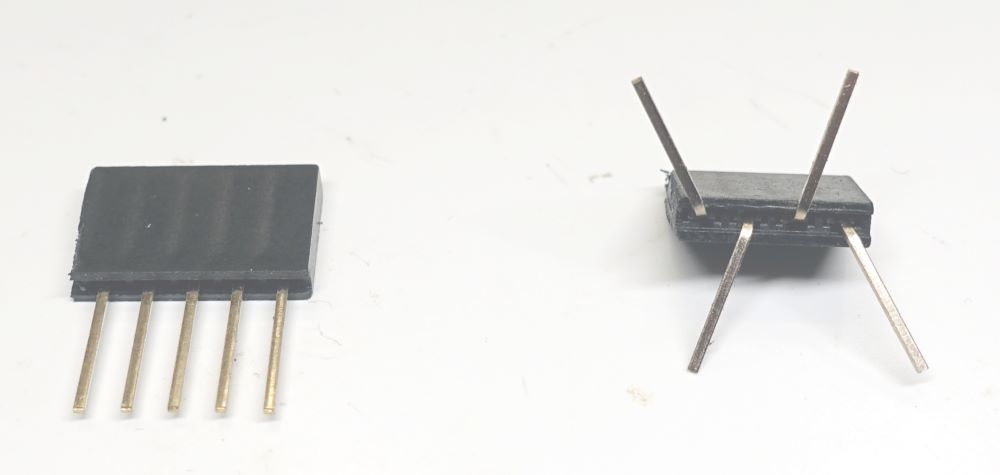
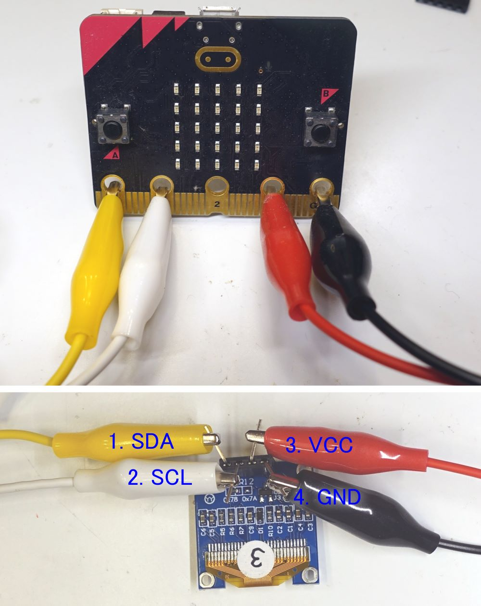

# micro:bitのI2C接続方法

## I2C接続OLED

* 使うもの

|||
|---|---|
|0.96インチ 128×64ドット有機ELディスプレイ(OLED) 白色|<a href="https://akizukidenshi.com/catalog/g/gP-12031/">https://akizukidenshi.com/catalog/g/gP-12031/</a>|  
|ピンソケット 1x5 リード長10mm|<a href="https://akizukidenshi.com/catalog/g/gC-06360/">https://akizukidenshi.com/catalog/g/gC-06360/</a>|  
|小型クリップ付コード 5色 45cm 5本入|<a href="https://akizukidenshi.com/catalog/g/gC-04351/">https://akizukidenshi.com/catalog/g/gC-04351/</a>|   

* OLEDの足は短いため、足の長いリードソケットを使う。 
4pinのピンソケットは販売してないので5pinのピンソケットを1本削って4pinにし、写真の通り足を曲げる。   
  

* 写真の通りOLEDとmicro:bitを接続、ワニ口同士がショートしないよう注意。 
  

* micro:bitへつくるっちFW書き込み。 下記hexファイルを「右クリック」「名前を付けてリンク先を保存」で保存し、micro:bitへダウンロード 
<a href="https://sohta02.sakura.ne.jp/tukurutch/static/extensions/Tukurutch.microbitV1.hex">micro:bit V1</a> 
<a href="https://sohta02.sakura.ne.jp/tukurutch/static/extensions/Tukurutch.microbitV2.hex">micro:bit V2</a>

* chromeブラウザでつくるっちアプリを開く  
<a href="https://sohta02.sakura.ne.jp/tukurutch/#000000542">SSD1306アニメ表示</a>

* I2C= の部分で "d0 c1 microbit" を選択  

* 左端のmicrobitを選択、USBまたはBLEを選択して "接続/切断 .."をクリック  

