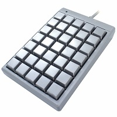

### ジェイダブル社キーボード MKBJ24/MKBJ35 とUSB2BTplusとの組み合わせ使用について

BitTradeOne社経由でお客様より表題の件についてお問い合わせを頂戴したため、ジェイダブル社様ご協力の元確認を実施しました。  
**MKBJ35とPC/スマフォをUSBで直接接続した場合、USB2BTplus経由で接続した場合のMKBJ35動作確認結果**  

|PC/スマフォ|USB直接接続|USB2BTp経由||
|---|---|---|---|
|Windows10|OK|USB接続: NG Bluetooth接続: OK|(USB接続)shiftを押しながらCAPSLOCKを 2回押すことで使用できます。|
|android9|OK|NG|対策方法 参照|
|ios9.3.5|NG|NG|対策方法 参照|
|ios13.5.1|OK|OK||

**検証機材**：MKBJ35(FW MKB35A V1.4), garaxy A7, ipod touch(MGG32J/A), iphone6S  

MKBJ24/MKBJ35は接続時にPC/スマフォから「LED設定コマンド」を受信してからキー入力に応答します。
PC/スマフォのOSの違いによりLED設定コマンドを送る場合と送らない場合があり、
確認したところ上記表の「NG」、androidと古いiosではbluetooth接続時LED設定コマンドを送らないためMKBJ24/MKBJ35を使用することができません。  

### 対策方法

androidと古いiosの場合、下記手順によりMKBJ24/MKBJ35を使用することが出来ます。  
1. USB2BTplusの「スマフォ切り替えボタン」にスマフォとWindows10(bluetooth接続)を設定  
2. MKBJ24/MKBJ35とUSB2BTp接続後いったんWindows10にBluetooth接続し、スマフォに戻す (MKBJ24/MKBJ35とUSB2BTpの電源をOFF/ONするごとに実施する必要があります)
  

### (参考)[USB2BTサポートサイト](http://sohta02.web.fc2.com/usb2bt.html)

2020/6/21
