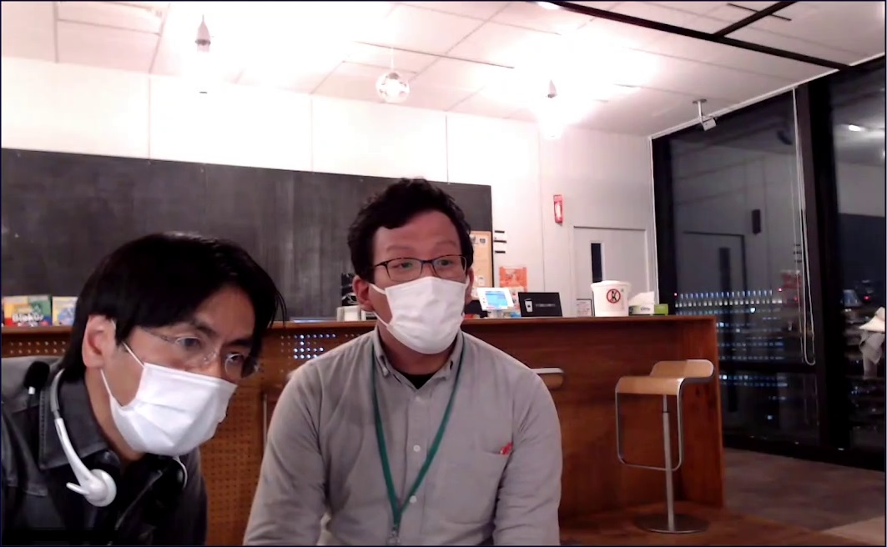

## 「メーカーエンジニア」による「メイカーズ活動」紹介イベントレポート（編集中）
様々なメーカーで活躍するエンジニアが、会社の業務から離れ個人で行う「メイカーズ活動」を紹介するイベントを開催しました。  
このイベントはそーたメイ主催で、Sony Bridge Terminalをお借りしてオンライン形式にて実施しました。
  
### そーたメイ
<video src="https://sohtamei.github.io/docs/images/sohtamei.mp4" height="300" controls></video>  
始め方はシンプルで、こういった活動向けにどういったfacebookや販売チャンネルがあるか、先に活動されていたThousanDIYさんにアドバイスを頂きました。活動っていろんなやり方がありますが知らないとなかなか手が出せません。以前にもこうした会を開き、その場でThousanDIYさんとつながり活動をやってきた経緯があります。今日は私の活動の紹介ですけども、今日参加された方にもぜひそういった形で色んな活動をやっていっていただければいいなと考えております。

### 池上 恵理
<video src="https://sohtamei.github.io/docs/images/ikegamiEri2.mp4" height="300" controls></video>  
最初はハッカソンに参加したのがきっかけで、そこで同じチームの人がCQ出版社の編集者さんを私に紹介してくれて記事を書くことになり、その後イベントに出て書いた記事や作品を展示していたらオーム社さんから本書いてみない？とお声がけいただいたり、さらにこういうLTするお時間頂いたりとか、自分の活動が色んな所に繋がっていくのが自分的にはとても楽しいと思っています。  
（これから始めたいという方へ）  
ツイッターに自分に作ったのとか写真を上げるとLチカでもいいねもらえるんで、ぜひ気軽にSNSの活動から始めてみるのがいいかなと思います。

### ThousanDIY
<video src="https://sohtamei.github.io/docs/images/ThousanDIY2s.mp4" height="300" controls></video>  
ぼくも始めたきっかけはたぶん池上さんとかと一緒で、もともとハッカソンとかちょこちょこと顔出していたんですけど、100円ショップ活動を始めたのは100均のグッズだけでハッカソンをやる「ヒャッカソン」というのを昔やってまして、それに参加したのがきっかけで、100円縛りで100均のグッズ買ってきてバラすとなかなか面白いので分解してたりしたんですね。そしたらそこのハッカソンで工学社の中継から編集長さんと知り合いになりまして、「こんなことやってる」っていったら「じゃあ記事書いてみない？」という形で記事を書いたのがきっかけです。  
それとは別に電子工作は昔からやって基板を起こして売ったりしてたんですけど、ちょっと違うのは作品じゃなくてツール作るのが好きなんでUSBシリアルのコンバータとかそんなのばっかり作ってました。人に見せるものが無かったんですけど、こういう分解したり部品作ったりするのが記事になって長く続けたらいいことあるなと思ってます。

### むらさき
<video src="https://sohtamei.github.io/docs/images/murasaki.mp4" height="300" controls></video>  
きっかけは商品のモックを作りたいというところからでした。  
アドバイスなんですが、世の中にないものを作ろうと思うと結構大変なので、まずは自分の身近にあるものをコピーするみたいな形から始めてもいいかなと思います。

### おばけパズル
<video src="https://sohtamei.github.io/docs/images/obakePuzzle.mp4" height="300" controls></video>  
私自身もメイカー活動が何なのか全然わかっていなかったんですけど、当時は品モノラボというコミュニティがありそこに参加することでこういうのがあるんだなというのが分かったんで、今回の集まり・イベントですとか、最初は機械の使い方や設計の仕方で分からない部分があるんで、先ほど池上さんが出されていた本を実際に買ってみるとか、そういったこともすごく入り込むきっかけになるのかなと思います。

### 水落 大
<video src="https://sohtamei.github.io/docs/images/mizuochiMasaru2.mp4" height="300" controls></video>  
コロナ以前までおすすめしていたのは、ハッカソンとか、数日単位で実際に作品を作っちゃうみたいな、そういうイベントに参加することをおすすめしてました。ハッカソンに参加すると何日に作品を作んなくちゃいけないという締め切りが決まるので、それに向けて動かざるをえない、締め切り駆動開発って言うんですけど、自分を追い込むタイプの作品づくりをするのが有効です。ただ、コロナになってあまり集まるとかもできなくなってるので、今おすすめするとすれば、自分のソーシャル活動の環境づくりですね。人間て自分の周りにいる人の平均になるって言いますよね。自分の周りの人がたくさん作ってると、自分も作りたくなってくるというか、そういうモチベーションが湧いてくるので、自分の周りにたとえば今日みたいな場所に参加して、知り合いを増やすとか、とにかく自分の周りをもの作りしてる人で固めてしまう。そうすると自然と自分も何か作りたくなるという気持ちが湧いてくるので、自分もちょっとずつ変わっていく変化のきっかけになるかなと思っています。

### そーたメイ＆淺野氏対談
今回のイベントでは以上の登壇に加え、ライター淺野氏による対談も実施しました。浅野氏はfabcrossサイトにてメイカーズ活動関連の記事[『委託、クラファン、サブスク——「個人がものを作って売る」の今』](https://fabcross.jp/topics/special/20220202_zadankai_2022.html)を執筆しました。  
対談については別途レポートを掲載の予定です。  
  

### 補足 「メーカー」と「メイカー」について
家電メーカーや自動車メーカーなど商品を開発・製造する会社のことをメーカーと呼びますが、これは和製英語で、英語では一般的に「Manufacturer」（マニュファクチャー）になります。
一方で「メイカーフェア東京」など、もの作りをする人のことを通常「メーカー」でなく「メイカー」と呼びますが、これえはクリスアンダーソンの著書「MAKERS」等によりMAKERという単語が日本で広まった際、和製英語の「メーカー」と区別するため「メイカー」になったものと思われます。どちらも英語では「maker」になります。
